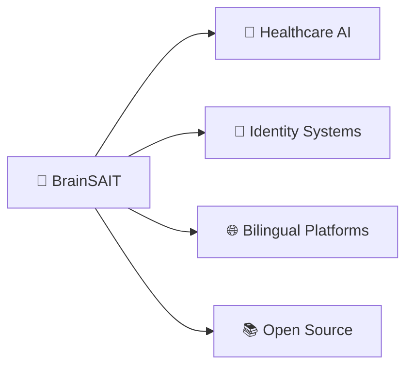

# 🩺 Dr. Fadil | د.فاضل

### Physician · Tech Entrepreneur · AI Innovator
### طبيب · رائد أعمال تقني · مبتكر في الذكاء الاصطناعي

---

*"Transforming ideas into innovation, one solution at a time"*  
*"تحويل الأفكار إلى ابتكار، حلّاً واحداً في كل مرة"*

 

## 👋 Welcome | أهلاً بك

<table>
<tr>
<td width="50%">

I'm **Dr. Fadil**, a physician and founder of **BrainSAIT**—a digital healthcare incubator at the intersection of health, AI, and business.

My mission is to leverage **collective intelligence**, **automation**, and **next-generation technology** to drive impactful solutions across healthcare, business, and beyond.

**Core Focus:**
- 🏥 Healthcare Digital Transformation
- 🤖 AI-Powered Agentic Systems
- 🌐 Bilingual Solutions (Arabic/English)
- 🚀 SME & Startup Empowerment

</td>
<td width="50%" dir="rtl">

أنا **د.فاضل**، طبيب ومؤسس **BrainSAIT**—حاضنة رقمية للرعاية الصحية تجمع بين الصحة والذكاء الاصطناعي والأعمال.

رسالتي هي الاستفادة من **الذكاء الجماعي** و**الأتمتة** و**التقنيات المتقدمة** لتقديم حلول مؤثرة في الرعاية الصحية والأعمال وما بعدها.

**التركيز الأساسي:**
- 🏥 التحول الرقمي في الرعاية الصحية
- 🤖 الأنظمة الوكيلة المدعومة بالذكاء الاصطناعي
- 🌐 الحلول ثنائية اللغة (عربي/إنجليزي)
- 🚀 تمكين المنشآت الصغيرة والشركات الناشئة

</td>
</tr>
</table>

 

## 🛠️ What I'm Building | ما أبنيه

<table>
<tr>
<td width="50%">

#### 🧠 **BrainSAIT Ecosystem**
AI-powered tools and agentic systems for healthcare digital transformation, workflow automation, and SME empowerment.

#### 🔐 **Unified Identity Systems**
OID-based digital profiles for doctors, nurses, patients, and innovators.

#### 🌐 **Bilingual Solutions**
Arabic/English platforms, eBooks, courses, and apps for MENA and global audiences.

#### 📚 **Open-Source Libraries**
Python, Swift, and API SDKs for interoperable, regulation-ready healthcare solutions.

</td>
<td width="50%" dir="rtl">

#### 🧠 **منظومة BrainSAIT**
أدوات وأنظمة وكيلة مدعومة بالذكاء الاصطناعي للتحول الرقمي في الرعاية الصحية وأتمتة سير العمل وتمكين المنشآت الصغيرة والمتوسطة.

#### 🔐 **أنظمة الهوية الموحدة**
ملفات تعريف رقمية قائمة على OID للأطباء والممرضين والمرضى والمبتكرين.

#### 🌐 **حلول ثنائية اللغة**
منصات ودورات وتطبيقات بالعربية والإنجليزية للمنطقة والعالم.

#### 📚 **مكتبات مفتوحة المصدر**
Python و Swift وSDKs للحلول الصحية القابلة للتشغيل البيني والمتوافقة مع الأنظمة.

</td>
</tr>
</table>

 

## 🌱 Currently Learning | ما أتعلمه حالياً

| Technology | Focus Area | التقنية | مجال التركيز |
|:---:|:---:|:---:|:---:|
| 🐍 | **Advanced Python** | بايثون متقدم | 🐍 |
| 🍎 | **Swift & SwiftUI** | سويفت وSwiftUI | 🍎 |
| 🤖 | **AI Agent Frameworks** | أطر عمل الوكلاء الذكية | 🤖 |
| ☁️ | **Cloud Automation** | أتمتة السحابة | ☁️ |
| ⚖️ | **Compliance Standards** | معايير الامتثال | ⚖️ |
| 💡 | **Digital Health & Entrepreneurship** | الصحة الرقمية وريادة الأعمال | 💡 |

 

## 🤝 Let's Collaborate | دعونا نتعاون

| 🌟 Area | English | العربية | 🌟 |
|:---:|:---|:---:|:---:|
| **AI** | AI in healthcare & business | الذكاء الاصطناعي في الرعاية الصحية والأعمال | **الذكاء الاصطناعي** |
| **Automation** | Workflow automation & agentic systems | أتمتة سير العمل والأنظمة الوكيلة | **الأتمتة** |
| **Open Source** | Bilingual & inclusive digital tools | أدوات رقمية مفتوحة المصدر ثنائية اللغة | **المصدر المفتوح** |
| **Innovation** | SME/Startup innovation in MENA | ابتكار الشركات الصغيرة والناشئة في المنطقة | **الابتكار** |

 

## 💬 Ask Me About | اسألني عن

<table>
<tr>
<td align="center" width="25%">

**🏥 Healthcare AI**  
Digital transformation  
& automation

**الذكاء الاصطناعي الصحي**  
التحول الرقمي والأتمتة

</td>
<td align="center" width="25%">

**⚡ SaaS Platforms**  
Scalable & agentic  
systems

**منصات SaaS**  
أنظمة قابلة للتوسع  
والوكيلة

</td>
<td align="center" width="25%">

**🌐 Bilingual Tech**  
Arabic/English  
content & outreach

**التقنية ثنائية اللغة**  
محتوى وتواصل  
عربي/إنجليزي

</td>
<td align="center" width="25%">

**🚀 Startups**  
MENA innovation  
& regulated markets

**الشركات الناشئة**  
الابتكار في المنطقة  
والأسواق المنظمة

</td>
</tr>
</table>

 

## 📫 Get in Touch | تواصل معي

<table>
<tr>
<td align="center">

**Professional Network**  
**الشبكة المهنية**

</td>
<td align="center">

**Updates & Insights**  
**التحديثات والرؤى**

</td>
<td align="center">

**Book a Meeting**  
**احجز موعداً**

</td>
<td align="center">

**Open an Issue**  
**افتح قضية**

</td>
</tr>
</table>

**📧 Email:** *Available on request | متاح عند الطلب*

 

## ⚡ Philosophy | فلسفتي

<table>
<tr>
<td width="50%">

🧠 **Building the "collective brain"** for digital health in Saudi Arabia and beyond

✨ Believe in **Original Intelligence (OI)** as much as **Artificial Intelligence (AI)**

🚀 Advocating for **seamless, regulation-friendly** digital innovation

🌍 **Bridging the gap** between technology and human-centered healthcare

</td>
<td width="50%" dir="rtl">

🧠 **أبني "العقل الجماعي"** للصحة الرقمية في السعودية وخارجها

✨ أؤمن بـ **الذكاء الأصيل (OI)** بقدر إيماني بـ **الذكاء الاصطناعي (AI)**

🚀 أدعو للابتكار الرقمي **السلس والمتوافق مع الأنظمة**

🌍 **أسد الفجوة** بين التكنولوجيا والرعاية الصحية الإنسانية

</td>
</tr>
</table>

 

---

## 📊 GitHub Analytics

---

### 💝 Support My Work | ادعم عملي

If my work helps you, consider supporting me through:  
إذا ساعدك عملي، فكّر في دعمي من خلال:

⭐ **Star** my repositories | **نجمة** لمستودعاتي  
🔄 **Share** my projects | **مشاركة** مشاريعي  
🤝 **Collaborate** on open source | **التعاون** في المصدر المفتوح

---

Built with ❤️ by Dr. Fadil | صُنع بـ ❤️ من د.فاضل

<!--
**Fadil369/Fadil369** is a ✨ *special* ✨ repository because its `README.md` (this file) appears on your GitHub profile.
-->
